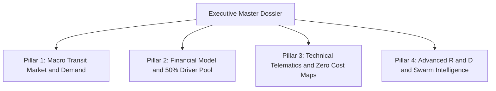
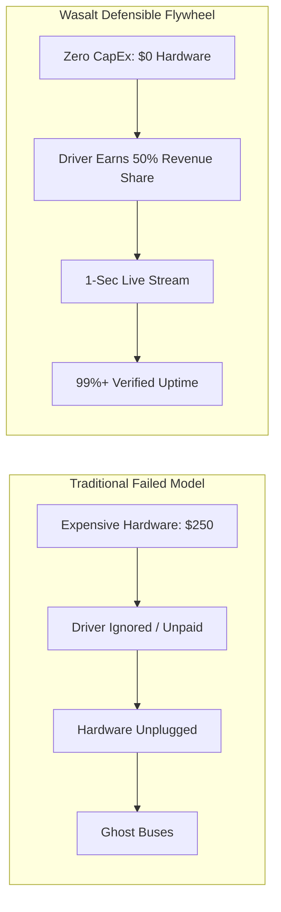
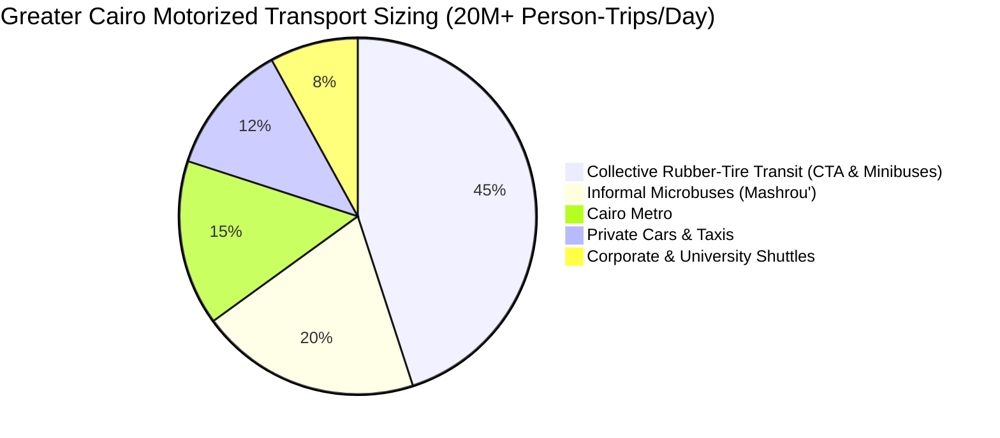
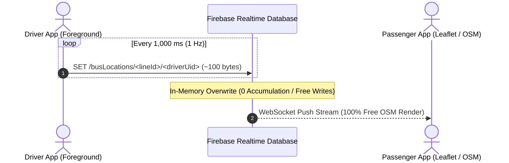
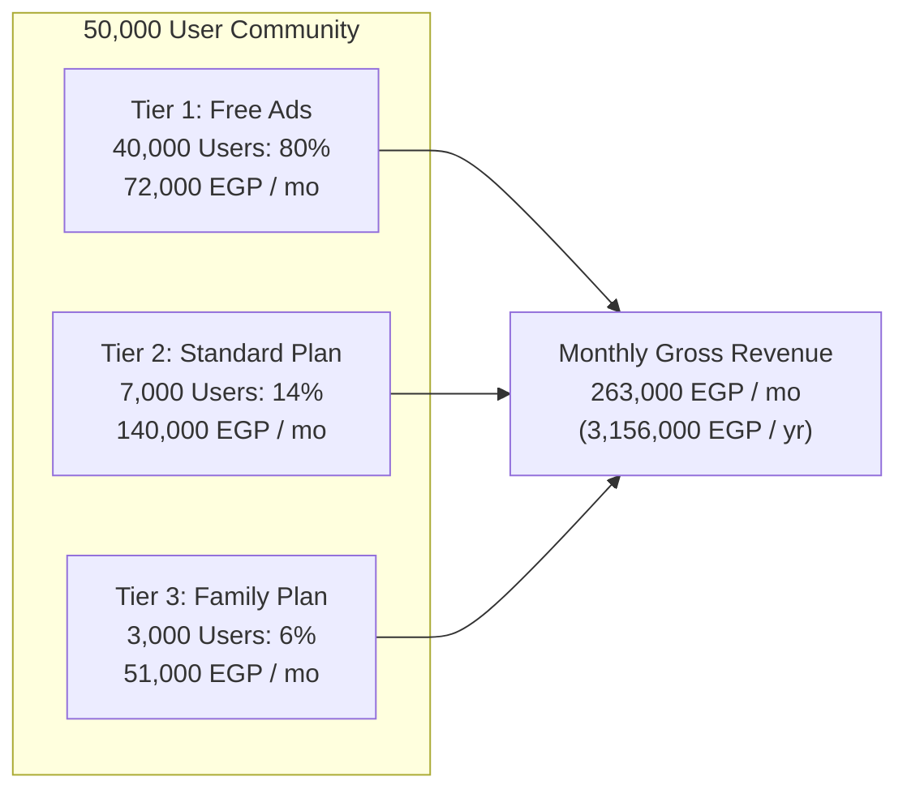
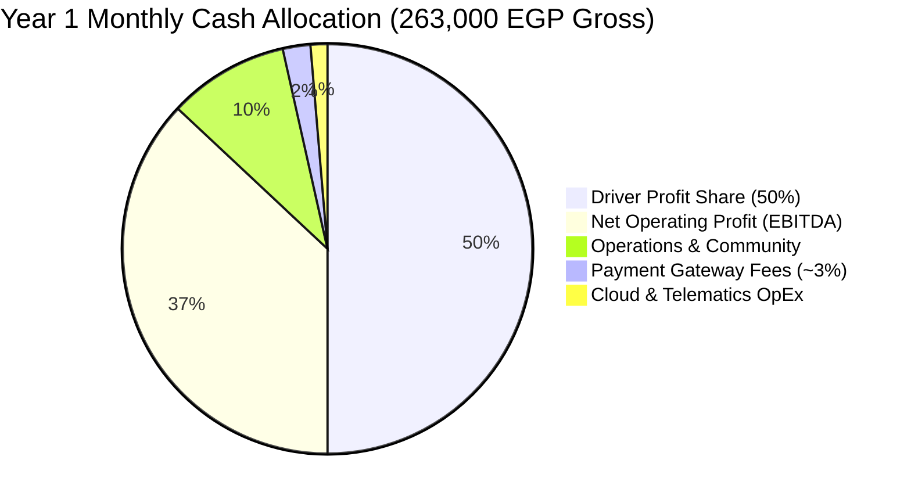
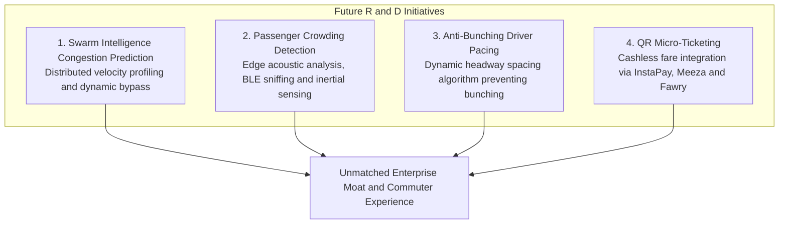

# Wasalt Transit Platform: Market Research, Empirical Data & Financial Projections

> **Document Type:** Executive Pitch Deck Dossier & Financial Master Plan  
> **Prepared For:** Kareem / Wasalt Board & Executive Stakeholders  
> **Compiled By:** Jarvis (Lead Engineering Assistant)  
> **Target Market:** Greater Cairo Metropolitan Area (GCMA) & Egyptian Transit Ecosystem  
> **Last Audited & Updated:** September 2026 (v2.0 — Post-Audit Master Release)  

---

## 📑 Modular Architecture Navigation

In accordance with our modular engineering standards, this master dossier synthesizes high-level projections and links directly to four specialized deep-dive documents:

* **[Pillar 1: Macro Transit Market & Empirical Data](file:///c:/Users/karee/OneDrive/Desktop/random%20projects/bus%20tracker%20sya7a%20version/docs/01_TRANSIT_MARKET_AND_MACRO_DATA.md)**
* **[Pillar 2: Financial Model, Unit Economics & 50% Driver Profit Share](file:///c:/Users/karee/OneDrive/Desktop/random%20projects/bus%20tracker%20sya7a%20version/docs/02_FINANCIAL_MODEL_AND_UNIT_ECONOMICS.md)**
* **[Pillar 3: Technical Infrastructure, 1-Second Telemetry & Zero-Cost Maps](file:///c:/Users/karee/OneDrive/Desktop/random%20projects/bus%20tracker%20sya7a%20version/docs/03_TECHNICAL_INFRASTRUCTURE_AND_TELEMETRY.md)**
* **[Pillar 4: Advanced R&D Roadmap, Swarm Intelligence & AI Crowding](file:///c:/Users/karee/OneDrive/Desktop/random%20projects/bus%20tracker%20sya7a%20version/docs/04_FUTURE_TECH_ROADMAP_AND_SWARM_INTELLIGENCE.md)**

---

## 1. Executive Summary & Core Investment Thesis

Greater Cairo transports over **13 million mass transit passengers every single day**. Despite immense demand, the ecosystem suffers from extreme operational opacity:
- **Commuters** waste 35–55 minutes of idle anxiety daily at stops due to zero Real-Time Passenger Information (RTPI).
- **Operators** suffer blind dispatching, bus bunching, and fuel waste.
- **Competitors Failed** (e.g. Tawwaly, Mwaslat Misr) because hardwired telematics boxes ($150–$300/bus) broke, and unpaid drivers actively disconnected GPS units, producing notorious **"ghost buses"**.

### Wasalt's Defensible Three-Part Solution
1. **Zero-CapEx Software:** Transforms driver smartphones into telematics beacons, eliminating all hardware costs.
2. **The 50% Driver Profit-Sharing Moat:** Allocating **50.0% of gross top-line revenue (1,315 EGP/mo per driver)** directly to active drivers guarantees 99%+ GPS uptime and turns drivers into invested quality champions.
3. **Zero-Cost Open-Source Cartography:** Embedded Leaflet.js with OpenStreetMap raster tiles guarantees **0 EGP mapping API costs** for both mobile and web command portals.

---

## 2. Market Sizing & Empirical Macro Data

* **Total Daily Motorized Trips:** **> 20.0 million person-trips / day** in Greater Cairo (*World Bank / CAPMAS*).
* **Mass Transit Modal Split:** **63% to 66%** of all motorized trips rely on collective transit.
* **Rubber-Tire Fleet Composition:**
  - **Cairo Transport Authority (CTA):** ~2,500 full-size public buses operating 173 lines across 17 major depots.
  - **Collective Transport Minibuses (*Mashrou' El-Naql El-Gama'i*):** ~1,800 licensed 26-seat minibuses operated by private concessionaires (**Primary Year 1 Beachhead**).
  - **Ring Road BRT:** 100 electric high-capacity buses across 49 stations (106 km loop).
* **Congestion Cost:** Traffic congestion drains **EGP 50+ Billion (~$8 Billion USD/year)**, or **3.6% to 4.0% of Egyptian GDP**.

---

## 3. High-Frequency 1-Second GPS Telematics & Zero-Cost Infrastructure

Wasalt operates at a **1-second (1 Hz continuous)** location broadcast interval, enabling fluid, animated vehicle markers matching modern ride-hailing standards.

### Telematics & Cloud Sizing (100 Active Buses)
* **Monthly Ingestion Rate:** $100\text{ buses} \times 14\text{ hours} \times 3,600\text{ sec} \times 30\text{ days} = \mathbf{151,200,000\text{ writes / month}}$.
* **Data Volume Written:** $151.2\text{M writes} \times 100\text{ bytes} = \mathbf{15.12\text{ GB / month}}$.
* **Write Pricing:** **$0.00 EGP** (Firebase Realtime Database does not bill for writes, unlike Firestore).
* **Map Display Costs:** **$0.00 EGP** (Leaflet 1.9.4 + OpenStreetMap tiles completely replace proprietary Google Maps SDKs).
* **Total Tech Infrastructure OpEx:** **~3,500 EGP / month** (~$70 USD) covering WebSocket egress, Vercel hosting, and store licenses.

---

## 4. Financial Projections & 50% Driver Profit Share

### A. Consumer Revenue Model (50,000 Year-1 Users)

* **Tier 1: Free (Ad-Supported):** 40,000 users × 3 impressions/day × 20 days @ 30 EGP eCPM = **72,000 EGP / month**.
* **Tier 2: Standard Plan:** 7,000 subscribers @ **20 EGP / month** = **140,000 EGP / month**.
* **Tier 3: Family Plan:** 3,000 subscribers @ **17 EGP / person / month** (min 3 members = 51 EGP) = **51,000 EGP / month**.
* **Total Monthly Gross Revenue:** **263,000 EGP / month** (**3,156,000 EGP / year**).

### B. 50% Driver Compensation Pool (100 Active Buses)
* **Monthly Driver Pool (50.0% of Gross Revenue):** **131,500 EGP / month** (**1,578,000 EGP / year**).
* **Monthly Payout per Driver (100 Buses):** **1,315 EGP / month**:
  - **1,115 EGP** base operational stipend.
  - **200 EGP** dedicated mobile 4G data & phone maintenance allowance.
* **Breakeven Unit Economics:**
  - **66 Standard paying subscribers** (at 20 EGP) fully fund one driver's entire compensation.
  - At our blended community ARPU of **5.26 EGP / user**, just **250 total active users** on a bus line achieve complete operational breakeven.

### C. Year 1 Pro Forma P&L Statement

| Budget Item | Monthly (EGP) | Annual (EGP) | % of Gross | Strategic Role |
| :--- | :--- | :--- | :--- | :--- |
| **Gross Revenue** | **+263,000 EGP** | **+3,156,000 EGP** | **100.0%** | Ads (72k) + Standard (140k) + Family (51k). |
| **Driver Profit Share (50%)** | **(131,500 EGP)** | **(1,578,000 EGP)** | **50.0%** | 100 drivers × 1,315 EGP/mo (1,115 base + 200 data). |
| **Cloud & Telematics OpEx** | **(3,500 EGP)** | **(42,000 EGP)** | **1.3%** | 1-sec RTDB writes, WebSocket fanout, 0-cost OSM. |
| **Payment Gateway Fees (~3%)** | **(5,730 EGP)** | **(68,760 EGP)** | **2.2%** | 3% processing fee on 191k subscription volume. |
| **Operations & Marketing** | **(25,000 EGP)** | **(300,000 EGP)** | **9.5%** | Driver onboarding kits, field marketing, support. |
| **Total Operating Expenses** | **(165,730 EGP)** | **(1,988,760 EGP)** | **63.0%** | Asset-light software margins. |
| **Net Operating Profit (EBITDA)**| **+97,270 EGP** | **+1,167,240 EGP** | **37.0%** | **High-yielding 37.0% EBITDA Margin.** |

---

## 5. Advanced Technology Roadmap & Deep-Tech Innovations

Beyond core telematics tracking, Wasalt is architecting next-generation transit intelligence systems:

1. **Swarm Intelligence Congestion Avoidance:**  
   Buses act as peer-to-peer mobile probes along identical corridors. The platform automatically detects micro-bottlenecks via speed anomalies and dispatches proactive bypass recommendations to trailing drivers without relying on commercial traffic APIs.
2. **Passenger Crowding Detection Engine:**  
   Combines Bluetooth Low Energy (BLE) peripheral sniffing, ambient cabin acoustic decibel sampling, and vehicle inertial acceleration metrics to classify crowding into *Empty*, *Moderate*, and *Full* statuses.
3. **Anti-Bunching Driver Pacing Algorithm:**  
   Dynamically adjusts driver dwell times at major hubs to solve the common urban transit issue of two buses arriving simultaneously followed by a 45-minute void.
4. **InstaPay & Meeza QR Micro-Ticketing:**  
   Instant mobile ticketing allowing commuters to board with encrypted dynamic QR codes scanned directly by the driver's smartphone.

---

## 6. Document Directory & Citations

1. **Detailed Specialized Modules:**
   - **[Pillar 1: Macro Market Data & Competitor Teardown](file:///c:/Users/karee/OneDrive/Desktop/random%20projects/bus%20tracker%20sya7a%20version/docs/01_TRANSIT_MARKET_AND_MACRO_DATA.md)**
   - **[Pillar 2: Financial Model & Unit Economics](file:///c:/Users/karee/OneDrive/Desktop/random%20projects/bus%20tracker%20sya7a%20version/docs/02_FINANCIAL_MODEL_AND_UNIT_ECONOMICS.md)**
   - **[Pillar 3: Technical Telematics & Zero-Cost Maps](file:///c:/Users/karee/OneDrive/Desktop/random%20projects/bus%20tracker%20sya7a%20version/docs/03_TECHNICAL_INFRASTRUCTURE_AND_TELEMETRY.md)**
   - **[Pillar 4: Advanced R&D Roadmap & Swarm Systems](file:///c:/Users/karee/OneDrive/Desktop/random%20projects/bus%20tracker%20sya7a%20version/docs/04_FUTURE_TECH_ROADMAP_AND_SWARM_INTELLIGENCE.md)**
2. **Official Citations & External Sources:**
   - **World Bank Cairo Congestion Study:** [World Bank Report 85848](https://documents.worldbank.org/en/publication/documents-reports/documentdetail/858481468249079363/cairo-traffic-congestion-study-final-report)
   - **Cairo Transport Authority & Governorate Census:** [State Information Service (SIS)](https://www.sis.gov.eg/) & [Cairo Governorate](https://www.cairo.gov.eg/)
   - **CAPMAS Transport Statistics:** [Central Agency for Public Mobilization and Statistics](https://www.capmas.gov.eg/)
   - **Transport for Cairo (TfC) Research:** [TfC Transit Studies](https://transportforcairo.com/)
