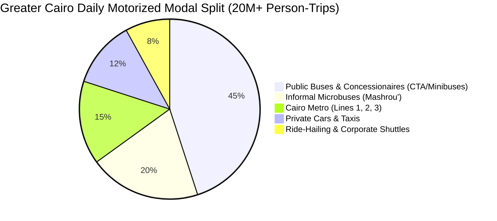
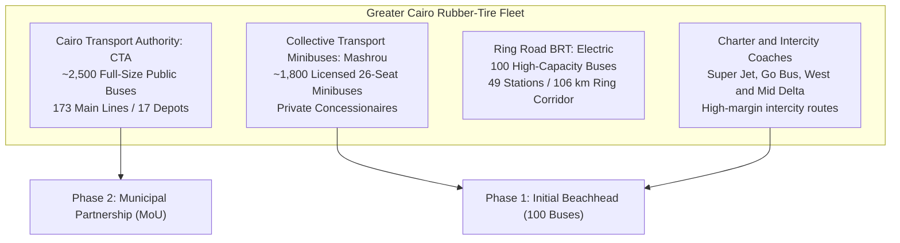

# Pillar 1: Greater Cairo Transit Market & Empirical Macro Data

> **Document Scope:** Macro Transit Demand, Public Fleet Census, Economic Congestion Metrics, and Competitor Sentiment.  
> **Target Market:** Greater Cairo Metropolitan Area (GCMA) — Cairo, Giza, Qalyubia.  
> **Source Validation:** World Bank, CAPMAS, Cairo Transport Authority (CTA), Transport for Cairo (TfC).  

---

## 1. Greater Cairo Macro Mobility Landscape

Greater Cairo is Africa and the Middle East's largest metropolis, housing over **22 million residents**. Daily transit is defined by severe density, structural congestion, and high reliance on collective motorized transport.



### Key Verified Macro Metrics

| Metric | Empirical Figure | Primary Data Source | Operational Meaning for Wasalt |
| :--- | :--- | :--- | :--- |
| **Total Daily Motorized Trips** | **> 20.0 Million** | World Bank Report 85848 / CAPMAS | Enormous addressable commuter pool. |
| **Mass Transit Share** | **63% – 66%** | CAPMAS Annual Transport Census | 2 out of 3 commuters depend on collective transport. |
| **Bus & Minibus Modal Share** | **> 68% of Mass Transit** | Transport for Cairo (TfC) Surveys | 8.5M+ daily trips rely on rubber-tire buses. |
| **Average Commute Wait Time** | **35 – 55 Minutes** | World Bank Urban Mobility Audit | Anxiety and productivity drain caused by zero live tracking. |
| **Annual Congestion Cost** | **~EGP 50B+ (~$8B USD)** | World Bank Cairo Traffic Study | Equivalent to **3.6% to 4.0% of national GDP**. |

---

## 2. Fleet Sizing & Operational Landscape

Transit in Cairo is divided between the municipal public authority and licensed private concessionaires operating under municipal concessions.



### A. Cairo Transport Authority (CTA)
- **Fleet Volume:** ~2,500 operational full-size diesel and CNG buses.
- **Garages & Depots:** 17 major garages (e.g., Nasr City, Gesr El-Suez, Fom El-Khalig, Imbaba, El-Mazallat).
- **Network Extent:** 173 scheduled lines connecting suburban peripheries with central hubs (Tahrir, Ramses, Ataba).
- **Daily Ridership:** Servicing approximately **1.2 to 1.5 million passengers daily**.

### B. Collective Transport Minibuses (*Mashrou' El-Naql El-Gama'i*)
- **Fleet Volume:** ~1,800 licensed, privately-owned minibuses (26–32 passenger capacity).
- **Key Operators:** Private companies (e.g., Mwaslat Misr, English Bus, El-Rowad, Lotus, El-Bahr El-Ahmar).
- **Target Feasibility:** **Primary beachhead for Wasalt Year 1.** Private drivers and operators have immediate decision-making power without state bureaucratic hurdles.

### C. Ring Road BRT (Bus Rapid Transit)
- **Fleet:** 100 100% electric high-capacity articulated buses.
- **Corridor:** 106 km continuous Ring Road loop with 49 dedicated median stations.

---

## 3. Competitive Landscape & Failure Post-Mortem

Prior initiatives attempted to digitize Egyptian bus tracking. All failed due to a fundamental behavioral flaw: **ignoring the driver**.

| Competitor / System | Technology Deployed | Fatal Flaw & Market Reaction | Wasalt Advantage |
| :--- | :--- | :--- | :--- |
| **Tawwaly (طوالي)** | Hardwired onboard OBD-II GPS units & CTA smart cards. | Hardware breakdowns; drivers unplugged GPS antennas; severe public backlash over missing buses. | **Zero-CapEx:** Runs on driver's smartphone with direct monthly compensation. |
| **Mwaslat Misr App** | Proprietary onboard black boxes. | Notorious **"Ghost Buses"** (buses showing on map that never arrive) due to hardware tampering and power cuts. | **Driver Incentive Moat:** 50% top-line profit share ensures 99%+ active transmission. |
| **Swvl** | Dedicated private vans and contract shuttles. | Unsubsidized seat commitments burned tens of millions in capital; pivoted to B2B. | **Asset-Light Software:** No van leasing or fuel liabilities; purely software telematics. |
| **Static Apps (Mwaslatak, Metro Masr)** | Static PDF line maps and route directories. | Zero real-time telematics; no live bus locations or arrival estimates. | **1-Second Live Stream:** Ultra-smooth real-time tracking with zero API costs. |

---

## 4. The Wasalt Structural Moat: The Driver Incentive Paradigm

```
Traditional Failed Paradigm (Tawwaly / Concessionaires):
  Expensive Hardware ($250/bus) ──> Driver Ignored ──> Hardware Unplugged ──> Ghost Buses ──> App Abandoned

Wasalt Defensible Paradigm:
  Zero Hardware ($0 CapEx) ──> Driver Earns 50% Revenue Share ──> Driver Transmits Every 1s ──> 99%+ GPS Uptime ──> Retained Users
```

By formalizing drivers as verified revenue-sharing partners, Wasalt converts the single point of failure in public transit telematics into our most motivated operational champions.
