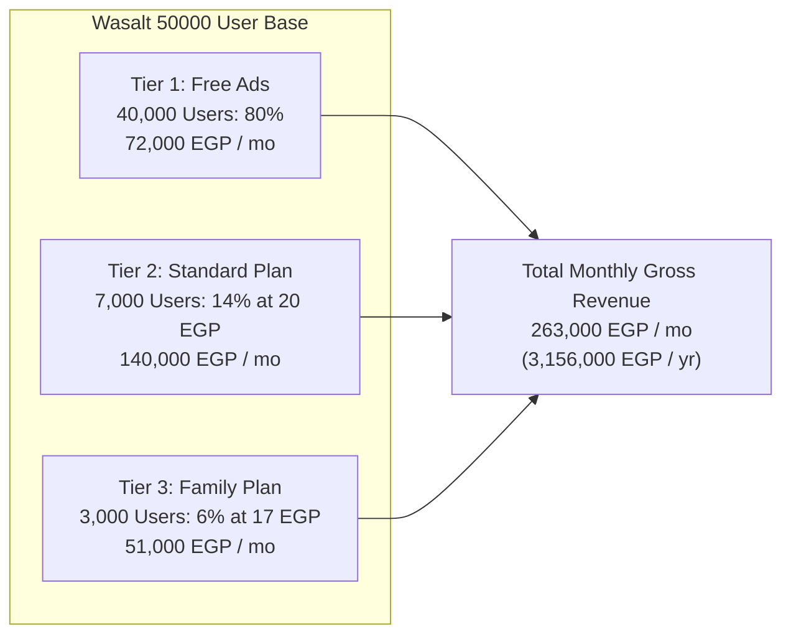
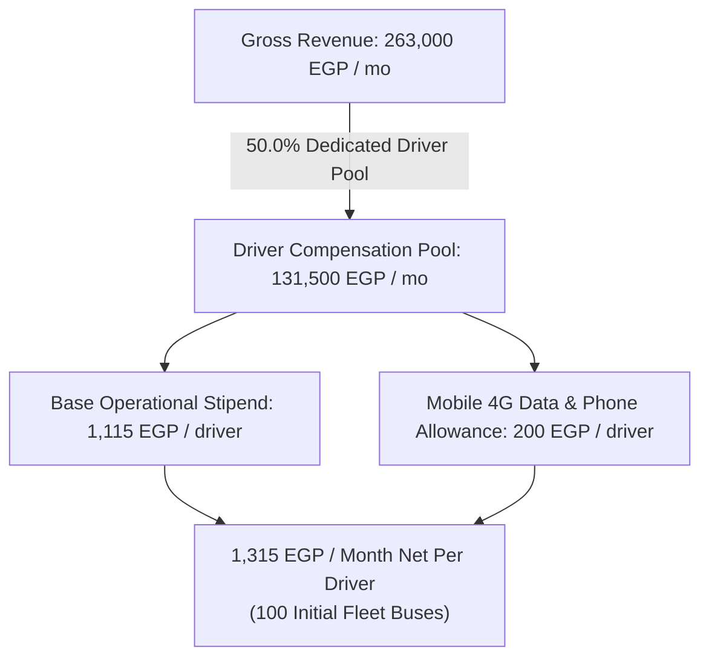
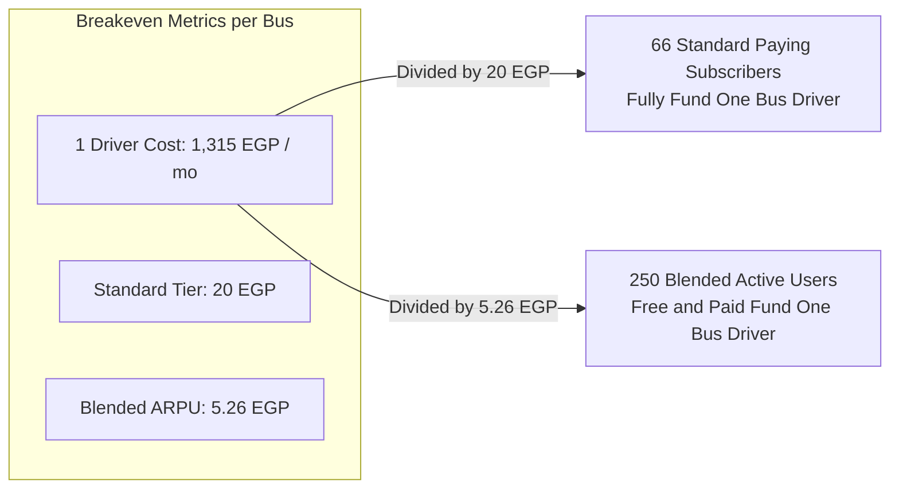
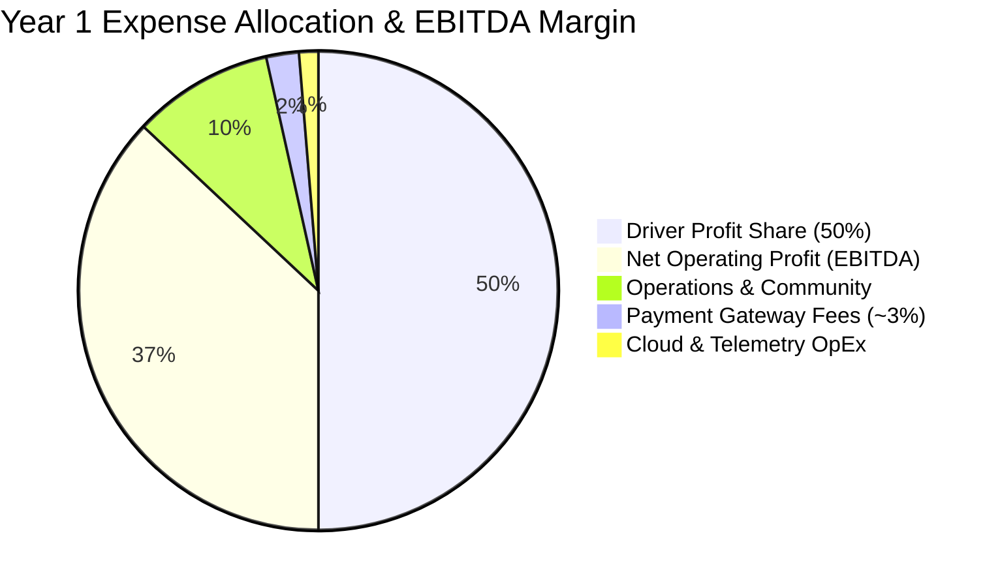

# Pillar 2: Financial Model, Unit Economics & 50% Driver Profit Share

> **Document Scope:** Consumer Monetization Tiers, 50% Driver Profit Sharing Pool, Unit Economics, and Year 1 Pro Forma P&L.  
> **Currency:** Egyptian Pounds (EGP). Benchmark exchange rate: ~50 EGP / 1 USD.  

---

## 1. Year 1 Consumer Monetization Structure (50,000 Users)

The consumer application operates on a 3-tier micro-monetization architecture balancing high organic viral adoption with recurring subscription cash flow:

### Plan Breakdown & Value Proposition

| Tier | Price Point | User Base Share | Monthly Volume | Core Feature Set & Differentiators |
| :--- | :--- | :--- | :--- | :--- |
| **Tier 1: Free** | **0 EGP** (Ad-Supported) | **80%** (40,000 users) | 40,000 users | Live bus map, line search, 1 saved favorite route. Monetized via targeted search & route banners. |
| **Tier 2: Standard** | **20 EGP** / month | **14%** (7,000 users) | 140,000 EGP | **100% Ad-Free**, dynamic arrival push notifications ("Bus is 2 stops away"), unlimited saved lines, crowding indicators. |
| **Tier 3: Family** | **17 EGP** / person / mo *(min 3 users = 51 EGP)* | **6%** (3,000 users / ~1k families) | 51,000 EGP | 15% discount, **Live Family Safety Sharing** (track boarding & arrivals for children/elderly), geofence alerts, one-tap SOS. |

### Gross Revenue Arithmetic
1. **Ad Revenue (Tier 1):**  
   $$40,000\text{ users} \times 3\text{ impressions/day} \times 20\text{ commute days} = 2,400,000\text{ monthly impressions}$$  
   $$\frac{2,400,000}{1,000} \times 30\text{ EGP eCPM} = \mathbf{72,000\text{ EGP / month}}$$
2. **Standard Subscriptions (Tier 2):**  
   $$7,000\text{ subscribers} \times 20\text{ EGP} = \mathbf{140,000\text{ EGP / month}}$$
3. **Family Subscriptions (Tier 3):**  
   $$3,000\text{ subscribers} \times 17\text{ EGP} = \mathbf{51,000\text{ EGP / month}}$$
* **Total Monthly Gross Revenue:** $72,000 + 140,000 + 51,000 = \mathbf{263,000\text{ EGP / month}}$ (**3,156,000 EGP / year**).

---

## 2. The 50% Driver Profit-Share Model

To guarantee 99%+ GPS uptime and eliminate ghost buses, Wasalt allocates **50.0% of total gross monthly revenue directly to active drivers**.

### Driver Compensation Breakdown (100 Active Buses)
* **Monthly Driver Pool (50% of 263,000 EGP):** **131,500 EGP / month** (**1,578,000 EGP / year**).
* **Per Driver Payout (100 Buses):** **1,315 EGP / month**:
  - **1,115 EGP** base monthly operational stipend (for keeping app foregrounded and GPS streaming).
  - **200 EGP** monthly allowance for high-speed 4G mobile data and phone mount/charger maintenance.

---

## 3. Unit Economics & Breakeven Analysis

### Breakeven Sizing
* **Standard Subscriber Breakeven:** $\frac{1,315\text{ EGP}}{20\text{ EGP}} = \mathbf{65.75\text{ (~66) paying subscribers}}$ fund one entire bus driver.
* **Blended Community Breakeven:**
  - Blended ARPU across all 50,000 users = $\frac{263,000\text{ EGP}}{50,000\text{ users}} = \mathbf{5.26\text{ EGP / user / month}}$.
  - Breakeven community per bus = $\frac{1,315\text{ EGP}}{5.26\text{ EGP}} = \mathbf{250\text{ total users}}$ (200 free users + 50 paying subscribers).
* **Corridor Scale Feasibility:**
  - One Cairo trunk bus carries **~800 to 1,200 passengers daily**. Capturing just **250 recurring users** on that line creates a self-sustaining, profitable micro-ecosystem.

---

## 4. Year 1 Pro Forma P&L Statement

| Line Item | Monthly (EGP) | Annual (EGP) | % of Gross | Strategic Notes |
| :--- | :--- | :--- | :--- | :--- |
| **Gross Revenue** | **+263,000 EGP** | **+3,156,000 EGP** | **100.0%** | Ads (72k) + Standard (140k) + Family (51k). |
| **Driver Compensation (50% Pool)** | **(131,500 EGP)** | **(1,578,000 EGP)** | **50.0%** | 100 buses × 1,315 EGP/mo (1,115 base + 200 data). |
| **Cloud & Telemetry Infrastructure** | **(3,500 EGP)** | **(42,000 EGP)** | **1.3%** | 1-sec RTDB writes, WebSocket fanout, 0-cost Leaflet/OSM. |
| **Payment Gateway Fees (~3%)** | **(5,730 EGP)** | **(68,760 EGP)** | **2.2%** | Calculated on 191k subscription revenue (Paymob/Fawry). |
| **Operations, Community & Marketing** | **(25,000 EGP)** | **(300,000 EGP)** | **9.5%** | Driver onboarding kits, marketing, support. |
| **Total Operating Expenses (OpEx)** | **(165,730 EGP)** | **(1,988,760 EGP)** | **63.0%** | Ultra-lean asset-light software cost base. |
| **Net Operating Profit (EBITDA)** | **+97,270 EGP** | **+1,167,240 EGP** | **37.0%** | **Robust 37.0% EBITDA Margin.** |

> [!NOTE]
> **Payment Gateway Fee Sensitivity:** If subscriptions are billed through Apple App Store / Google Play In-App Purchase (15% Small Business Program), processing fees rise from 5,730 EGP to **28,650 EGP / mo**, leaving EBITDA at **+74,350 EGP / mo (~28.3% margin)** — still exceptionally profitable.
