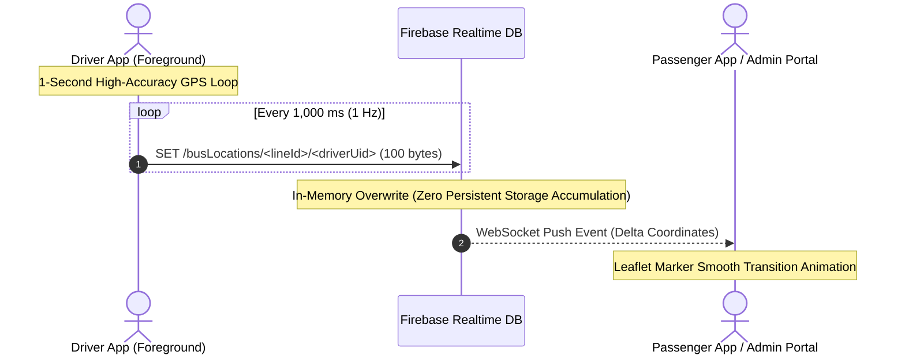
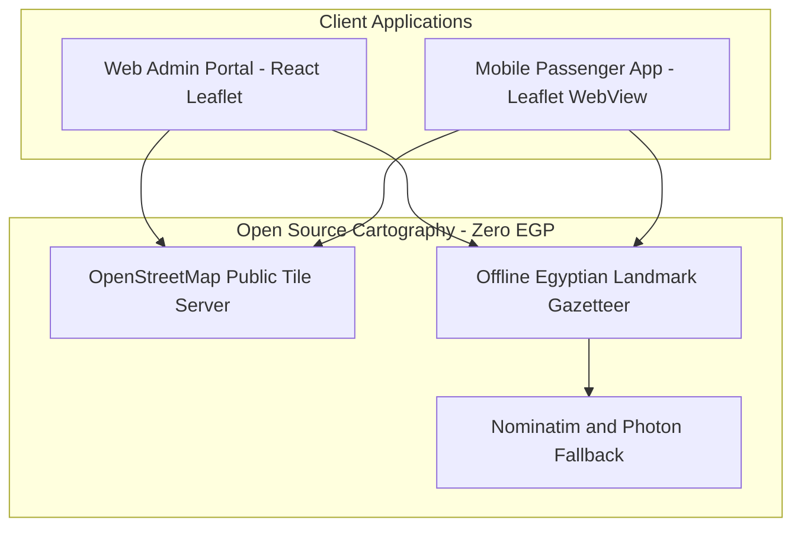
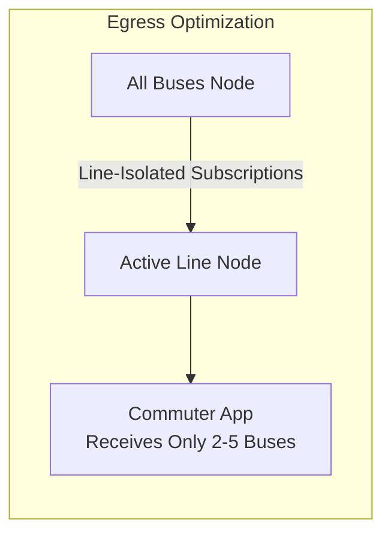

# Pillar 3: Technical Infrastructure, 1-Second Telemetry & Zero-Cost Maps

> **Document Scope:** High-Frequency GPS Telematics, Realtime Database Ingestion Math, Zero-Cost OpenStreetMap Architecture, and Bandwidth Scaling.  
> **Codebase Alignment:** `sya7a/` (React Native / Expo / Leaflet WebView) & `admin/` (React 19 / Vite / React-Leaflet).  

---

## 1. High-Frequency 1-Second GPS Telematics Engine

To provide passenger experiences matching Uber and Google Maps, Wasalt upgrades GPS broadcast frequency from 5 seconds to **1 second (1 Hz continuous)**.

### Telematics Ingestion Math (100 Active Buses)

| Parameter | Calculation | Monthly Metric |
| :--- | :--- | :--- |
| **Shift Duration** | 14 operational hours / day | 50,400 seconds / bus / day |
| **Daily Ingestion Rate** | $100\text{ buses} \times 50,400\text{ seconds} \times 1\text{ write/sec}$ | **5,040,000 writes / day** |
| **Monthly Ingestion Rate** | $5,040,000\text{ writes} \times 30\text{ days}$ | **151,200,000 writes / month** |
| **Payload Size per Write** | `{ lat, lng, lastUpdated, endPoint, driverName }` | ~100 bytes (WGS84 JSON) |
| **Monthly Data Written** | $151,200,000 \times 100\text{ bytes}$ | **~15.12 GB / month** |
| **Instantaneous Database Footprint**| 100 buses overwritten in place | **~10 KB to 15 KB** (Static) |

> [!TIP]
> **Firebase RTDB vs Firestore Advantage:**  
> Firestore charges per document write ($0.18 per 100k writes). Ingesting 151M writes into Firestore would cost **$272 USD / month**.  
> **Firebase Realtime Database does NOT charge for writes** — writes are completely free! RTDB only bills for stored data ($5/GB) and egress bandwidth ($1/GB beyond 10 GB free).

---

## 2. Zero-CapEx & Zero-API Map Architecture

Wasalt avoids vendor lock-in and prohibitive mapping fees (Google Maps charges $7.00 per 1,000 loads) through an offline-capable, open-source cartographic stack.

### Architectural Highlights
1. **Embedded Leaflet WebView:** The mobile client embeds a high-performance, lightweight HTML Leaflet container (`sya7a/src/components/OpenStreetMap.html`). Custom SVG bus marker rotation runs directly in the WebView hardware-accelerated graphics context.
2. **Zero Commercial API Fees:**
   - Google Maps SDK API keys: **$0.00** (Not needed).
   - Directions & Polyline API: **$0.00** (Admin portal stores route polylines directly in RTDB).
   - Tile Downloads: **$0.00** (OpenStreetMap public tiles with local device raster caching).
3. **Egyptian Landmark Gazetteer:** Curated offline dictionary of prominent terminals snaps locations instantly without outbound geocoding requests.

---

## 3. Bandwidth Egress & Cloud Cost Sizing

### Bandwidth & Infrastructure Projections

| Infrastructure Element | Technical Scaling Math | Estimated Monthly Cost |
| :--- | :--- | :--- |
| **RTDB Writes (151M/mo)** | Ephemeral key-value replacement under `/busLocations/<lineId>/<driverUid>`. | **$0.00 EGP** (Writes are free on RTDB) |
| **RTDB Persistent Storage** | Fleet catalog, user histories, company schemas (~50 MB total). | **$0.00 EGP** (Within 1 GB free tier) |
| **WebSocket Egress (1-sec reads)**| Line-isolated subscriptions: 1,500 peak concurrent commuters receiving 3 buses @ 1s = ~40–60 GB/mo. | ~$40 – $50 USD (~2,000 – 2,500 EGP) |
| **OpenStreetMap Tile Loads** | Raster tile caching in local device storage. | **$0.00 EGP** |
| **Web Admin & Auth Hosting** | Vercel Hobby + Firebase Auth (50,000 MAUs free tier). | **$0.00 EGP** |
| **App Store Licenses** | Google Play ($25 one-time) + Apple Developer ($99/year amortized). | **~415 EGP / month** |
| **Total Cloud & Tech OpEx** | **Ultra-scalable infrastructure with >98% gross margins.** | **~3,500 EGP / month** |
