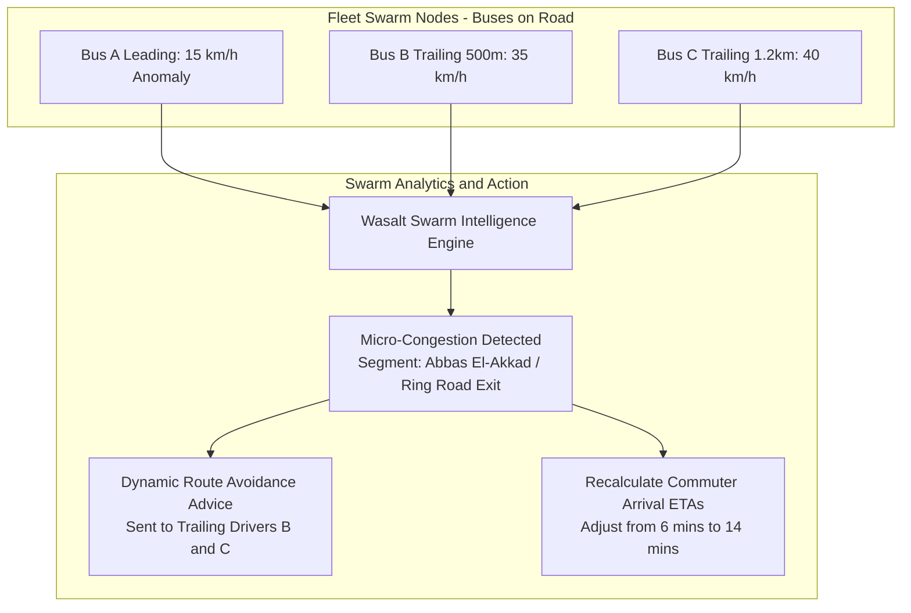
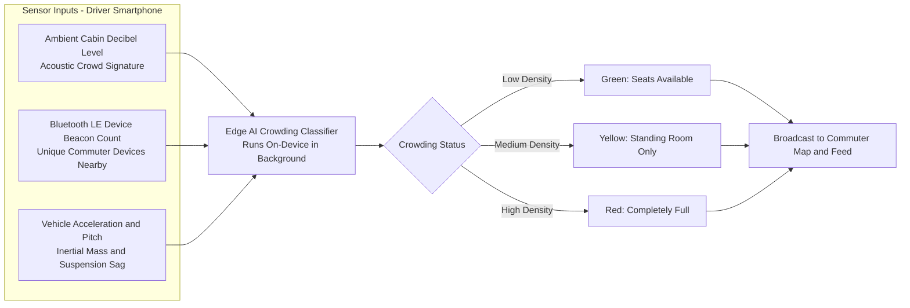
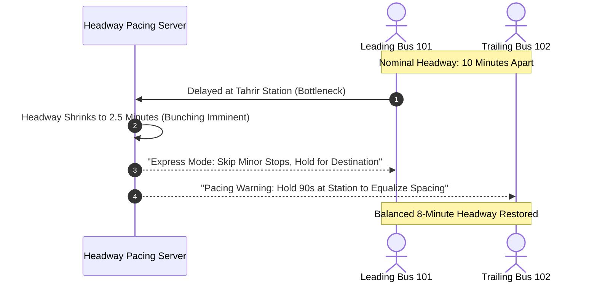
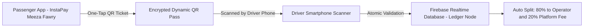

# Pillar 4: Advanced R&D Roadmap, Swarm Intelligence & AI Crowding Detection

> **Document Scope:** Deep-Tech Innovations, Swarm Intelligence Congestion Avoidance, Passenger Crowding Detection, and Fleet Optimization Systems.  
> **Horizon:** Post-MVP Engineering Roadmap (Phases 3–5).  

---

## 1. Swarm Intelligence Congestion Prediction & Dynamic Routing

Because Wasalt buses transmit 1-second continuous telemetry along identical transit corridors, the fleet acts as a **distributed sensor network (Swarm)**.

### Technical Mechanisms
1. **Kinetic Velocity Profiling:**  
   Every bus streams velocity calculated over 3-second sliding windows. When multiple buses on the same road segment experience a >40% drop below historic moving averages, the system automatically registers an active bottleneck without relying on third-party traffic APIs (e.g., Google Traffic).
2. **Pheromone-Inspired Avoidance Routing:**  
   Mimicking ant colony algorithms, road segments with severe velocity drops are dynamically "penalized" in route calculations. Trailing drivers receive preemptive dispatch alerts via the Driver Home Screen recommending authorized bypass corridors (e.g., taking the Nasr City flyover rather than ground lanes).
3. **Hyper-Localized Egyptian ETA Model:**  
   Standard navigation algorithms fail in Cairo traffic because bottlenecks are intermittent (choke points at U-turns, microbus informal stops). The swarm model learns corridor-specific slowdown patterns by hour of day and day of week.

---

## 2. Real-Time Passenger Crowding Detection Engine

Commuters consistently cite overcrowded buses as their primary transit frustration. Wasalt introduces an automated, multi-tiered crowding estimation framework:

### Crowding Detection Modalities

| Modality | Sensor Mechanism | Accuracy & Privacy Safeguard |
| :--- | :--- | :--- |
| **1. Bluetooth LE RSSI Sniffing** | Scans for nearby broadcasting BLE UUIDs (commuter smartphones and wearables). | **100% Privacy Compliant:** MAC addresses are immediately hashed into ephemeral counts; zero PII stored. |
| **2. Cabin Acoustic Analysis** | Measures ambient background chatter decibel levels via microphone FFT spectra. | Audio is never recorded or transmitted; only raw aggregated sound pressure levels (dBA) are processed on-device. |
| **3. Inertial Vehicle Dynamics** | Accelerometer and gyroscope detect inertia curves during braking/acceleration to infer payload weight. | High mass results in slower acceleration curves for identical throttle profiles. |
| **4. Driver 1-Tap Toggle (Fallback)** | Driver quick-select buttons on the steering console HUD (`Empty`, `Half`, `Full`). | Simple human-in-the-loop manual confirmation when picking up at major hubs. |

---

## 3. Anti-Bunching Driver Pacing Protocol

### Algorithmic Solution to the "Two Buses Arrive Together" Syndrome
* **The Transit Physics Flaw:** When a leading bus falls slightly behind schedule, it encounters more passengers waiting at subsequent stops, delaying it further. The trailing bus encounters empty stops and speeds up, inevitably catching the first bus (**"Bus Bunching"**).
* **Wasalt Headway Regularity Algorithm:**  
  The system tracks the interval $H_{ij} = t_j - t_i$ between successive vehicles on the same route. If $H_{ij} < 0.35 \times H_{\text{nominal}}$, the trailing driver's console signals an intentional dwell hold (holding at a high-capacity terminal for 60–90 seconds) to restore uniform passenger spacing across the city.

---

## 4. Digital QR Micro-Ticketing & Integrated Payments

* **Cashless Transit Adoption:** Transition Egyptian commuters from paper cash and lost change to 1-tap QR boarding.
* **National Payment Rail Integration:** Direct compatibility with **InstaPay (IPN)**, **Meeza digital wallets**, and **Vodafone/Orange/Etisalat Cash**.
* **Zero Additional Hardware:** The driver's existing smartphone camera acts as the high-speed optical barcode validator.
